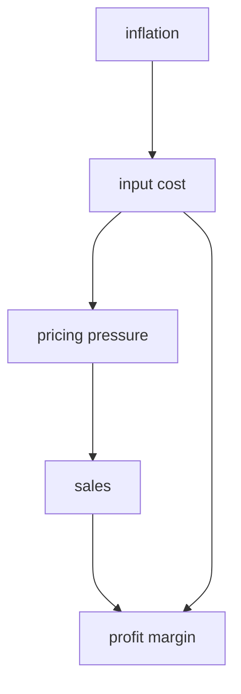

#FSA #IndustryAndCompanyAnalysis 

## Competition 
Can be analysed using [[Porters5Forces]] framework 
## Inflation 

### Input costs 
- Check how each segment (geo and product) is affected by inflation 
- Other factors 
	- Weather 
	- Regulation 
	- Taxation and Tariffs 
	- Characteristics of input market. 
 - Can input material be switched to a substitute 
 - If input is of commodity-type (with wild swinging prices) can use hedging techniques 
	 - This would only help the firm only in the short term though. 
 - If company is a [[VerticallyIntegratedCompany]]

## pricing pressure

- if the company is neither hedged nor vertically integrated, check how much cost can be passed on to customers. 
	- If price change is temporary -> Company can absorb this by cutting costs from other divisions  
	- If price change is sustained -> Company would need to pass on increase to customers. 

- Need to access products elasticity. 
- Even if the demand in perfectly inelastic, though the net income would remain the same, but profit margin would reduce. 

- Pricing would also depend on the competition. 
- Competitor who would increase the price first would lost market share. 
- But even if the prices are kept same the profit margins would anyway decrease. 

## Technological development 
- Due to technological advancements, suppliers are able to produce more, 
	- hence supply curve would shift to the right, i.e. sales increases and prices fall. 
- But there is also a likelihood of development of a substitute product, 
	- which would shift demand curve to the left due to [[Cannibalisation]]
	- hence reduce sales and decrease price even further. 

Different sales channels would be affected differently. 
