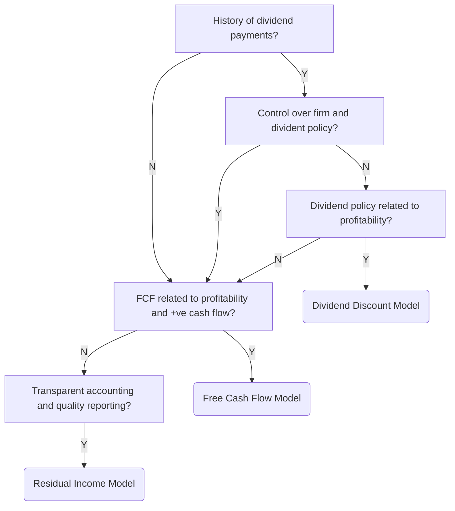

#EquityInvestements 

Aggregate the present value of the future cash flows to calculate the intrinsic value of the stock. 

Models include the following: 
1. [[DividendDiscountModel]]
2. [[FreeCashFlowModel]]
3. [[ResidualIncomeModel]]

