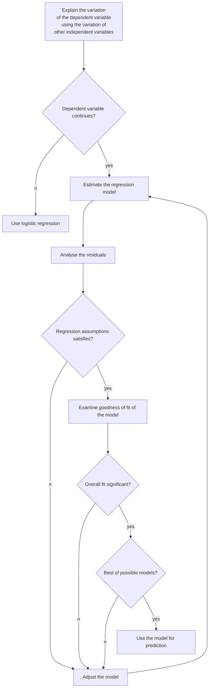

#BasicsOfMultipleRegressionAndUnderlyingAssumptions #Regression

- Regression process covers several decisions:
	1. Identify dependent and independent variables
	2. Select appropriate regression model
	3. Test if assumptions are satisfied
	4. Examine goodness of fit 
	5. Make needed adjustment

Process of linear regression

